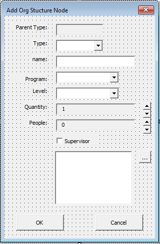
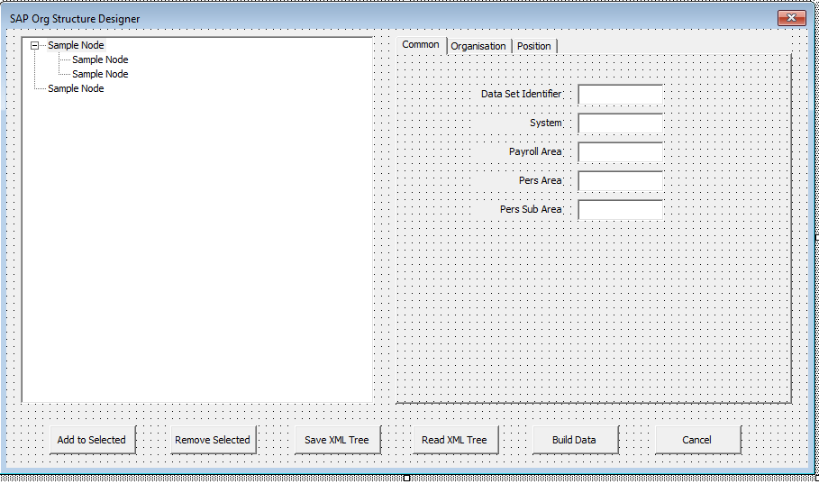

# sap-hr-payroll-travel
Data Generation for UFT

## Introduction
This entire project consists of the spreadsheet used to generate synthetic data for a payroll merge project.

Test Automatiomn was engaged to create a test suite which server two purposes:
a. Create Struture and Data (employees)
b. Regression test the various data entry tasks

## Results
The sheet generated all the data used by the project. The estimate from a senior SAP expert is a saving of 3 months to create and enter data

## Achievements
- A custom ribbon was created to run the coded tasks, including sending to QTP or the manual test teams
- Random names included famous names (eg Elvis Presly) or joke names (Dwayne Pipe) which was welcomed by the teams as a talking point and a bit of fun with their task.
- The HR structures were expressed as a visial element on an excel form, exported or imported and used to control the entire SAP transaction calls, tie created positions to supervisors and payroll
- The process was recognised as a differernt approach to a common problem that created substantial improvements in both time and handling of complex data needs

## Sample images

